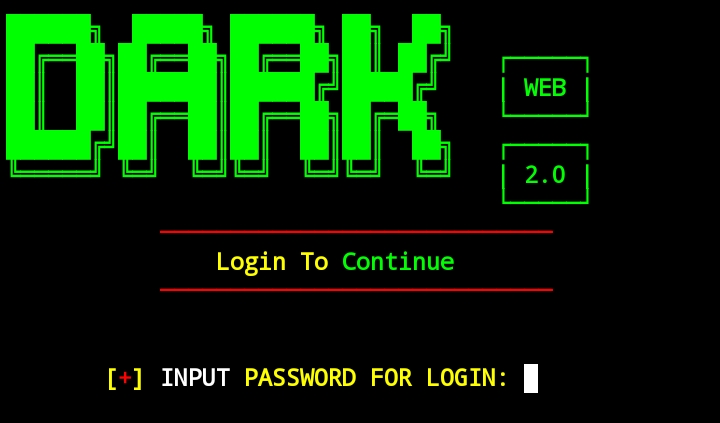
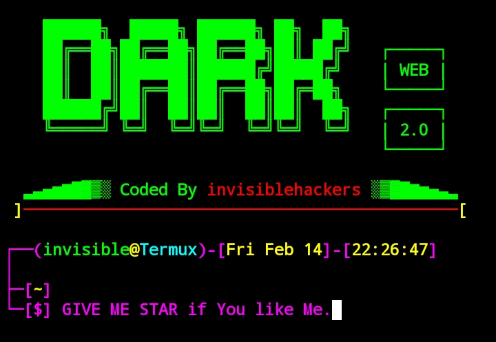

<p align="center">
</a>
</p>
<h1 align="center">Termux-lock</h1>
<p align="center"> 
  
  
  <br>
  
  
  
</p>

## 📌 About Termux-Lock
Termux-Lock is a security tool designed to lock Termux and prevent unauthorized access. When installed, it requires the correct password to unlock Termux. If the wrong password is entered, a fake matrix effect (cmatrix -L) runs, making the terminal unusable until a new session is started.
This tool is helpful for protecting sensitive Termux sessions and preventing unauthorized users from accessing your data.

## After installing Termux-lock
### Login Screen

### Termux Terminal


## Features Of Termux-lock
- [x] Termux Locking System
- [x] Secure Password Storage
- [x] Backup & Restore Support
- [x] Real Matrix Lock
- [X] Easy To Use
- [X] Terminal Clock
> Locks Termux with a password prompt, Runs cmatrix -L on incorrect password attempts, making Termux unusable Displays a hacker-style login screen and shell prompt Saves the password in a local hidden file, Backs up bash.bashrc and motd before modification.🔹Protection from Attackers The script only affects your Termux session and cannot be bypassed unless Termux is manually reset.

## AVAILABLE ON :
* Termux
### TESTED ON :
* Termux

## INSTALLATION [Termux] :
## All Commands in Single Line
```
apt update && apt upgrade && pkg install git && git clone https://github.com/invisiblehackers/Termux-lock.git && cd Termux-custom && chmod 755 * && bash login.sh
```
## Delete and set Default then run commands :
* cd Termux-lock
* bash backup.sh

## Copyright Notice

All content, including but not limited to code, documentation, and assets, within the Termux-lock repository is protected under copyright law. This repository, authored by Grey Hat Hacker [invisiblehackers], is provided for educational purposes only. It does not promote or condone any unauthorized access, modification, or misuse of computer systems or networks.
